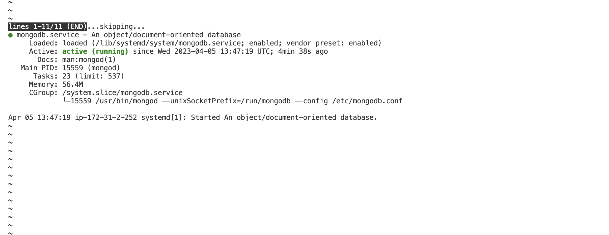

# **MEAN STACK IMPLEMENTATION**

## **MEAN STACK DEPLOYMENT TO UBUNTU IN AWS**

- MEAN Stack is a combination of following components:
1. **MongoDB** (Document database) – Stores and allows to retrieve data.
2. **Express** (Back-end application framework) – Makes requests to Database for Reads and Writes.
3. **Angular** (Front-end application framework) – Handles Client and Server Requests
4. **Node.js** (JavaScript runtime environment) – Accepts requests and displays results to end user.

### **Install Node.JS**

- Update and Upgrade UBUNTU

`sudo apt update && sudo apt upgrade`

- Add certificates

```
sudo apt -y install curl dirmngr apt-transport-https lsb-release ca-certificates

curl -sL https://deb.nodesource.com/setup_12.x | sudo -E bash -
```

- save and exit with :wq!


- Install NodeJS

`sudo apt install -y nodejs`


### **Installing MongoDB**

- MongoDB stores data in flexible, JSON-like documents. Fields in a database can vary from document to document and data structure can be changed over time. For our example application, we are adding book records to MongoDB that contain book name, isbn number, author, and number of pages.
mages/WebConsole.gif

`sudo apt-key adv --keyserver hkp://keyserver.ubuntu.com:80 --recv 0C49F3730359A14518585931BC711F9BA15703C6`

`echo "deb [ arch=amd64 ] https://repo.mongodb.org/apt/ubuntu trusty/mongodb-org/3.4 multiverse" | sudo tee /etc/apt/sources.list.d/mongodb-org-3.4.list`

- Install MongoDB

`sudo apt install -y mongodb`


- Start The server

`sudo service mongodb start`

- Verify that the service is up and running

`sudo systemctl status mongodb`




- Install npm – Node package manager

`sudo apt install -y npm`


- Install body-parser package (NB;'body-parser' is needed to help us process JSON files passed in request to the server)

`sudo npm install body-parser`


- Create a folder named ‘Books and cd to Books

`mkdir Books && cd Books`

- In the Books directory, Initialize npm project

`npm init`


- Add a file to it named server.js

`vi server.js`

- Copy and paste the web server code below into the server.js file

```
var express = require('express');
var bodyParser = require('body-parser');
var app = express();
app.use(express.static(__dirname + '/public'));
app.use(bodyParser.json());
require('./apps/routes')(app);
app.set('port', 3300);
app.listen(app.get('port'), function() {
    console.log('Server up: http://localhost:' + app.get('port'));
});
```
- Save and exit :wq!

### **Install Express and set up routes to the server**

- Express is a minimal and flexible Node.js web application framework that provides features for web and mobile applications. We will use Express in to pass book information to and from our MongoDB database.
We also will use **Mongoose** package which provides a straight-forward, schema-based solution to model your application data. We will use Mongoose to establish a schema for the database to store data of our book register.

`sudo npm install express mongoose`


- In ‘Books’ folder, create a folder named apps and cd apps

`mkdir apps && cd apps`

- Create a file named routes.js

`vi routes.js`

- Copy and paste the code below into routes.js

```
var Book = require('./models/book');
module.exports = function(app) {
  app.get('/book', function(req, res) {
    Book.find({}, function(err, result) {
      if ( err ) throw err;
      res.json(result);
    });
  }); 
  app.post('/book', function(req, res) {
    var book = new Book( {
      name:req.body.name,
      isbn:req.body.isbn,
      author:req.body.author,
      pages:req.body.pages
    });
    book.save(function(err, result) {
      if ( err ) throw err;
      res.json( {
        message:"Successfully added book",
        book:result
      });
    });
  });
  app.delete("/book/:isbn", function(req, res) {
    Book.findOneAndRemove(req.query, function(err, result) {
      if ( err ) throw err;
      res.json( {
        message: "Successfully deleted the book",
        book: result
      });
    });
  });
  var path = require('path');
  app.get('*', function(req, res) {
    res.sendfile(path.join(__dirname + '/public', 'index.html'));
  });
};
```

save and exit with :wq!

- In the ‘apps’ folder, create a folder named models and cd models

`mkdir models && cd models`

- Create a file named book.js

`vi book.js`

- Copy and paste the code below into ‘book.js’

```
var mongoose = require('mongoose');
var dbHost = 'mongodb://localhost:27017/test';
mongoose.connect(dbHost);
mongoose.connection;
mongoose.set('debug', true);
var bookSchema = mongoose.Schema( {
  name: String,
  isbn: {type: String, index: true},
  author: String,
  pages: Number
});
var Book = mongoose.model('Book', bookSchema);
module.exports = mongoose.model('Book', bookSchema);
```

- save and exit with :wq!

### **Access the routes with AngularJS**

- AngularJS provides a web framework for creating dynamic views in your web applications. We use AngularJS here to connect our web page with Express and perform actions on our book register.

- Change the directory back to ‘Books’

`cd ../..`

- Create a folder named public and cd public

`mkdir public && cd public`

- Add a file named script.js

`vi script.js`

- Copy and paste the Code below (controller configuration defined) into the script.js file.

```
var app = angular.module('myApp', []);
app.controller('myCtrl', function($scope, $http) {
  $http( {
    method: 'GET',
    url: '/book'
  }).then(function successCallback(response) {
    $scope.books = response.data;
  }, function errorCallback(response) {
    console.log('Error: ' + response);
  });
  $scope.del_book = function(book) {
    $http( {
      method: 'DELETE',
      url: '/book/:isbn',
      params: {'isbn': book.isbn}
    }).then(function successCallback(response) {
      console.log(response);
    }, function errorCallback(response) {
      console.log('Error: ' + response);
    });
  };
  $scope.add_book = function() {
    var body = '{ "name": "' + $scope.Name + 
    '", "isbn": "' + $scope.Isbn +
    '", "author": "' + $scope.Author + 
    '", "pages": "' + $scope.Pages + '" }';
    $http({
      method: 'POST',
      url: '/book',
      data: body
    }).then(function successCallback(response) {
      console.log(response);
    }, function errorCallback(response) {
      console.log('Error: ' + response);
    });
  };
});
```

- In public folder, create a file named index.html

`vi index.html`

- Copy and paste the code below into index.html file.

```
<!doctype html>
<html ng-app="myApp" ng-controller="myCtrl">
  <head>
    <script src="https://ajax.googleapis.com/ajax/libs/angularjs/1.6.4/angular.min.js"></script>
    <script src="script.js"></script>
  </head>
  <body>
    <div>
      <table>
        <tr>
          <td>Name:</td>
          <td><input type="text" ng-model="Name"></td>
        </tr>
        <tr>
          <td>Isbn:</td>
          <td><input type="text" ng-model="Isbn"></td>
        </tr>
        <tr>
          <td>Author:</td>
          <td><input type="text" ng-model="Author"></td>
        </tr>
        <tr>
          <td>Pages:</td>
          <td><input type="number" ng-model="Pages"></td>
        </tr>
      </table>
      <button ng-click="add_book()">Add</button>
    </div>
    <hr>
    <div>
      <table>
        <tr>
          <th>Name</th>
          <th>Isbn</th>
          <th>Author</th>
          <th>Pages</th>

        </tr>
        <tr ng-repeat="book in books">
          <td>{{book.name}}</td>
          <td>{{book.isbn}}</td>
          <td>{{book.author}}</td>
          <td>{{book.pages}}</td>

          <td><input type="button" value="Delete" data-ng-click="del_book(book)"></td>
        </tr>
      </table>
    </div>
  </body>
</html>
```

- cd back up to books

`cd ..`

- Start the server by running this command

`node server.js`

- The server is now up and running, we can connect it via port 3300. You can launch a separate Putty or SSH console to test what curl command returns locally.

`curl -s http://localhost:3300`


- To access from the internet, you need to open TCP port 3300 in your AWS Web Console for your EC2 Instance.

- Now we can access our Book Register web application from the Internet with a browser using Public IP address or Public DNS name

`http://<public-ipaddress>:3300`


## **Thank You!**

##**BLOCKERS**##
When i ran the `node server.js` command, it returned a syntax error. The error seems to be related to the use of the nullish coalescing operator ??, which was introduced in Node.js version 15.0.0/later


Which made me upgrade my current version of nodejs and mongodb to the latest version using the code

`sudo npm install -g n`
`sudo n stable`

`npm install mongodb@latest`

I, changed directory to operations and opened the add_user.js using text editor

`cd node_modules/mongodb/lib/operations`

`vim add_user.js`

I then went ahead to edit the coalescing operator **??** , changed it to **||**, to make it look like **this.options = options || {};**

save and exit with :wq!

run `node server.js` again

